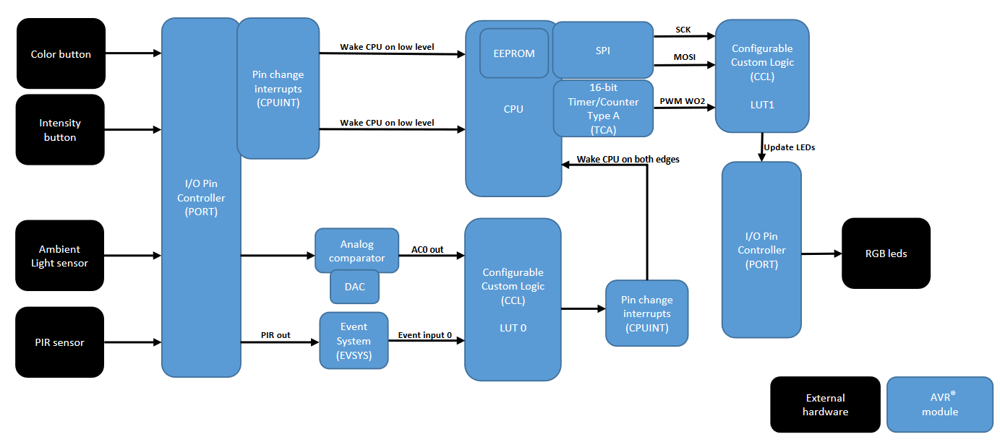
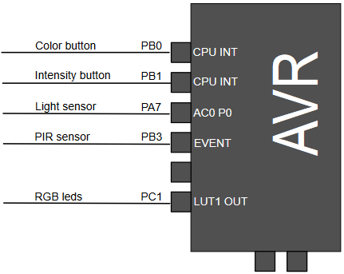

# ATtiny1617 Core Independent Nightlight Using Configurable CustomLogic

This example shows the use of Core Independent Peripherals (CIP), how to use theConfigurable Custom Logic (CCL) to filter inputs from different sensors, and how to create specificcommunication protocols using a Microchip AVR® device, a Passive InfraRed sensor (PIR), Ambient LightSensor, and 16 addressable RGB LEDs. Many peripherals are configured to work together, independentof the CPU.

The example is explained in more details in the application note [AN2387](#Related-Documentation)

## Related Documentation

- [AN2387 - Core Independent Nightlight Using Configurable CustomLogic on ATtiny1617](https://www.microchip.com//wwwAppNotes/AppNotes.aspx?appnote=en595063)
- [ATtiny1617 Product Page](https://www.microchip.com/wwwproducts/en/ATtiny1617)
- [ATtiny1617 datasheet](http://ww1.microchip.com/downloads/en/DeviceDoc/ATtiny1614-16-17-DataSheet-DS40002204A.pdf)

## Software Used

- [MPLAB X IDE v5.40 or later](https://www.microchip.com/mplab/mplab-x-ide)
- [XC8 (v2.20)](https://www.microchip.com/mplab/compilers) alternativly [AVR/GNU C Compiler 5.4.0](https://www.microchip.com/mplab/avr-support/avr-and-arm-toolchains-c-compilers) can be used
- ATtiny_DFP 2.2.89 or later

## Hardware Used

-  [ATtiny1617 QFN](https://www.microchip.com/wwwproducts/en/ATtiny1617)
-  [STK600](https://www.microchip.com/developmenttools/ProductDetails/ATSTK600)
-  [STK600 Routing card](https://www.microchip.com/DevelopmentTools/ProductDetails/atstk600-rc103)
-  [STK600 QFN24](https://www.microchip.com/developmenttools/ProductDetails/ATSTK600-SC62)
-  [ATATMEL-ICE](https://www.microchip.com/DevelopmentTools/ProductDetails/ATATMEL-ICE) to program since programming over STK600 is not supported in MPLABX
- Passive Infrared Detector (PIR)
- Ambient Light Sensor - [TEMT6000](http://www.vishay.com/docs/81579/temt6000.pdf) 
- Intelligent Control LED we use a WS2812B-16 board 

## Setup

*   Color Button Connected to `PB0`
*   Intensity Button Connected to `PB1`
*   Ambient Light Sensor Connected to `PA7`
*   PIR Sensor Connected to `PB3`
*   RGB LED Connected to `PC1`

## Operation

1. Open `CoreIndependentNightLightusingCCL.X` in MPLAB.
2. Connect the ATtiny1617 with your programmer of choice, we used a Atmel ICE.
3. Make sure the kit is selected as the tool to be programmed under project settings.
4. Press the make and program button to program the device.
4. Press one of the buttons or interact with the sensors to wake the AVR and start the processing.

## Conclusion

We have shown how you can make a core independent nightlight using configurable customlogic. This is just one of the many usecases of configurable customlogic.